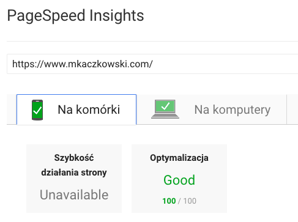
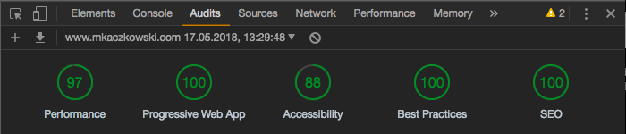

# ⚛ daftcode-react-starter

Hyper-performant React boilerplate for everyone

## 🎮 Demo
You can see how it performs live on:
[https://mkaczkowski.com](https://www.mkaczkowski.com)

Demo storybook can be found here:
[https://wizardly-poitras-931354.netlify.com](https://wizardly-poitras-931354.netlify.com)

## Performance:

Taken: 17 May 2018

#### Google Insight:


#### Chrome Audits:


 - TODO: [Accessibility] fix background/foreground contrast

## 🕹 Features
* [React (v16.3)](https://reactjs.org) - a JavaScript library for building user interfaces
* [Flow](https://github.com/facebook/flow) - Adds static typing to JavaScript
* [React Hot Loader (v4)](https://github.com/gaearon/react-hot-loader) - tweak React components in real time
* [Babel](https://babeljs.io) - a JavaScript compiler
* [Webpack (v4)](https://webpack.js.org) with plugins - a module bundler
* [Jest](https://facebook.github.io/jest/) - complete testing solution
* [Styled-Components] - CSS in JS  (https://styled-components.com) - add a bit of style to your website
* [React Snap](https://github.com/stereobooster/react-snap) - prerendering static sites
* [Lodable Components](https://github.com/smooth-code/loadable-components) - react code splitting made easy
* [Storybook](https://github.com/storybooks/storybook) - interactive UI component dev & test
* [PWA](https://developers.google.com/web/progressive-web-apps/) - progressive Web App ready
* Assets optimization (png/jpg/svg/webp)
* Critical fonts optimization
* Async/Defer/Preload scripts
* Modernizr - feature detection
* GZip compression

Tweak React components in real time ⚛️⚡️
* [ESLint](https://eslint.org) + [Prettier](https://prettier.io)

TODO:
- CSSGrid
- i18n
- Email form integration with Netlify

## 🔧 Installation

Clone repository to your local workspace:
```bash
git clone https://github.com/mkaczkowski/daftcode-react-starter.git
```

Install project dependencies using npm or yarn:

```bash
cd daftcode-react-starter
npm install
```

## 🎮 Development

Start developing your own website:

```bash
npm run start
```

Open in your browser:

```bash
http://localhost:3000
```

## 👌 Production

Production build of the website:

```bash
npm build
```

Serve build files on your local server:

```bash
npm serve
```

Open in your browser:

```bash
http://localhost:5000
```

## 🔠 Critical Font
We can limit generate subset of fonts to use only unicode-ranges that are used on a web site (optionally for a font-family or for each font-family).

#### Install
```bash
pip install fonttools
pip install brotli
pip install zopfli
```
#### Run local server
```bash
yarn serve
```

#### Generate subset webfonts
```bash
glyphhanger http://localhost:5000/index.html --family='Ubuntu' --subset=build/*.ttf --css
```

## 📜 License

MIT

## 👨 Author

Mariusz Kaczkowski from [DaftCode](http://daftcode.pl)
